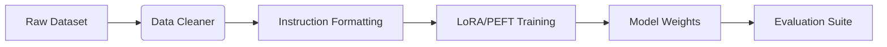

# LLM Fine-Tuning Framework

A complete MLOps pipeline for fine-tuning open-source LLMs on custom instruction datasets.

## Tech Stack
- **Python** (PyTorch / Transformers)
- **Model Engineering** (LoRA, PEFT)
- **Evaluation** (Automated benchmark suites)


## Architecture



## Live Endpoint (Interactive Demo)
This project is deployed as a serverless backend on Vercel. You can test the API instantly via your terminal.

```bash
# Example Request
curl -X GET https://llm-finetuning-framework-fmh6uvqoj-dev4aibots.vercel.app/api/health
```

## Demo
To generate a terminal GIF demonstration using `vhs`, run:
```bash
vhs demo.tape
```
